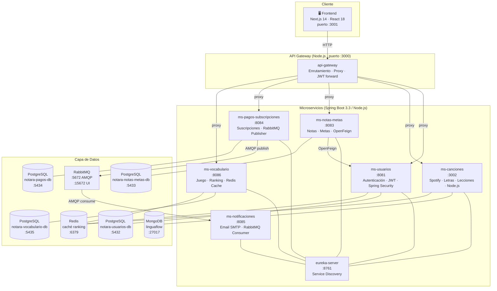
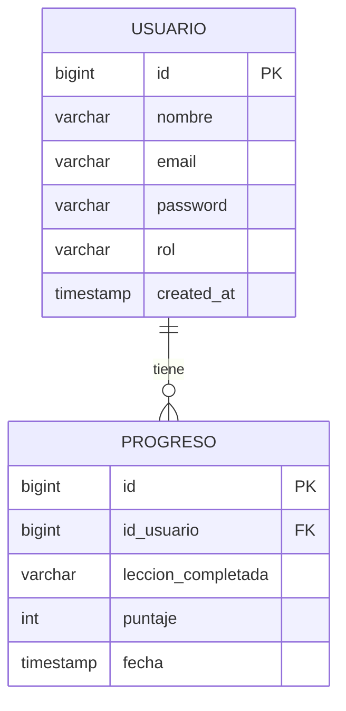
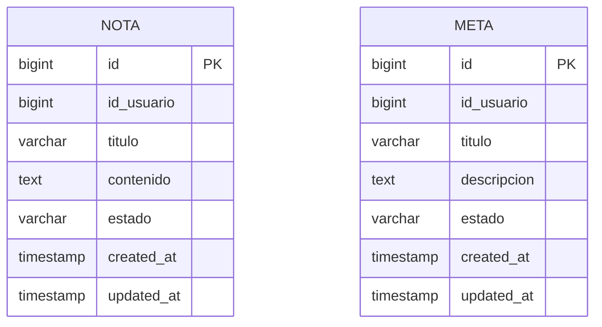
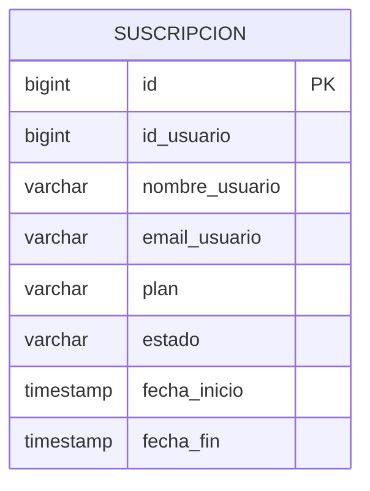
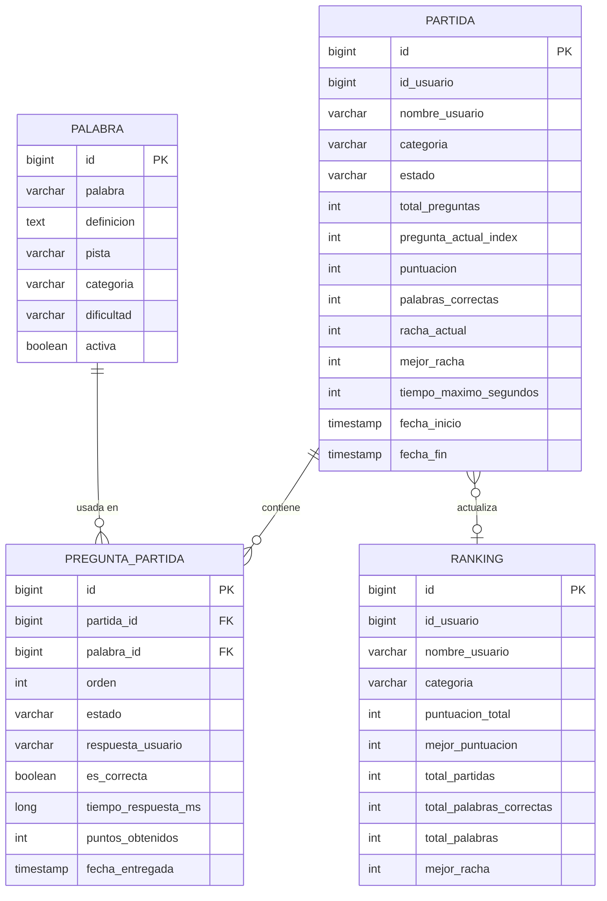
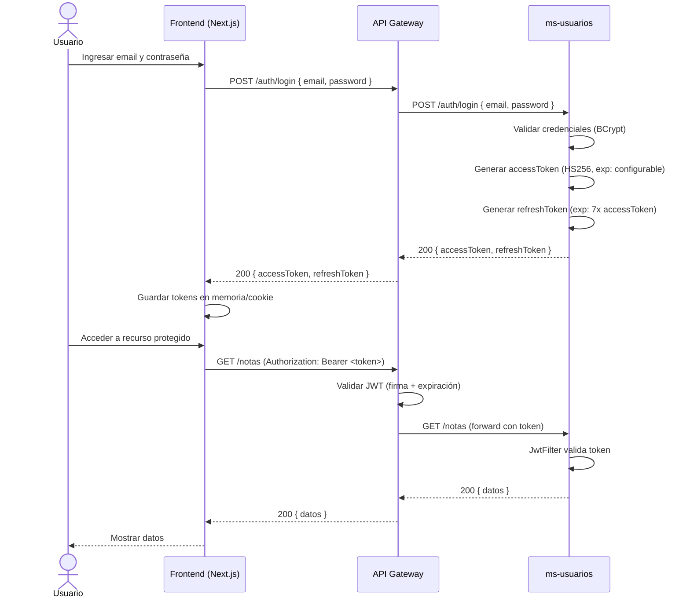
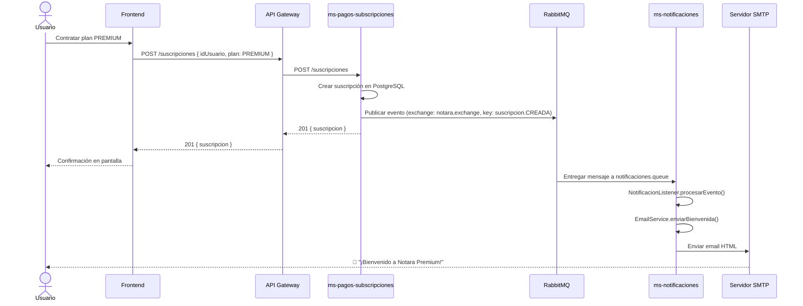
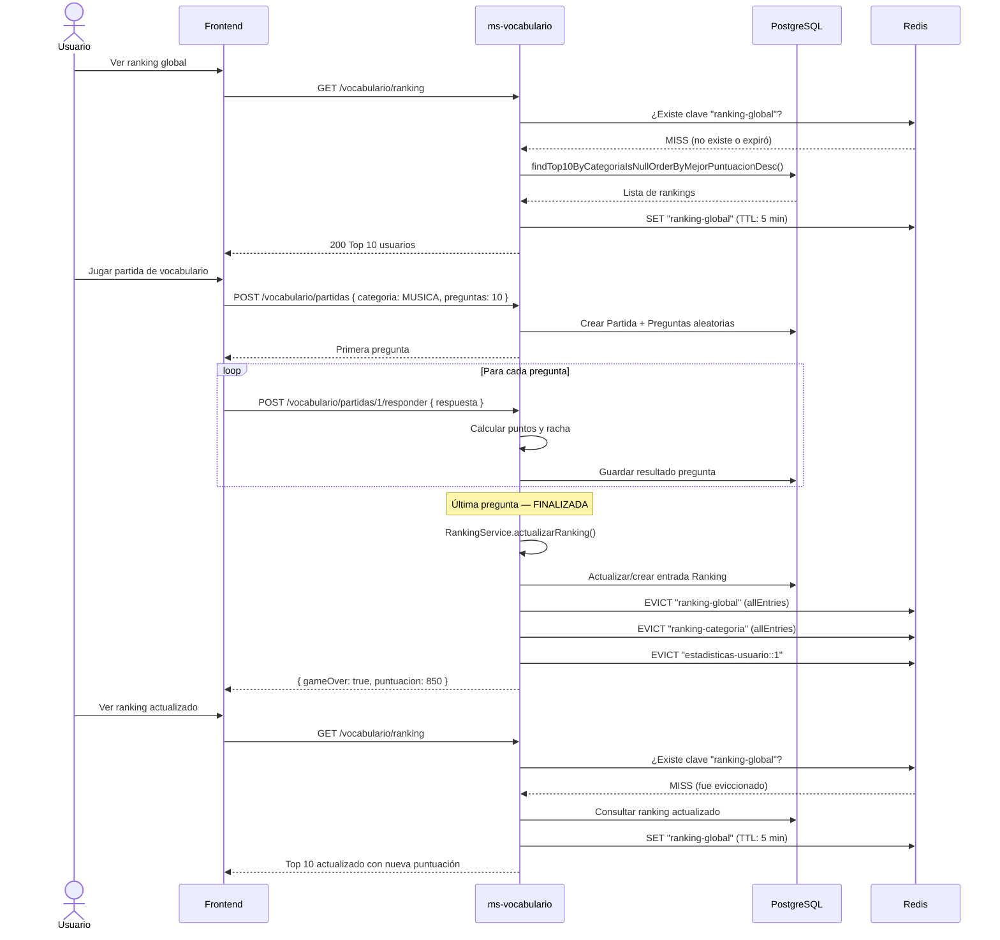

# Diagramas del Sistema — Notara

## 1. Diagrama de Arquitectura

Visión general del sistema con todos los microservicios, bases de datos e infraestructura.

---

## 2. Diagrama ERD — Entidades por Microservicio

### ms-usuarios

### ms-notas-metas

### ms-pagos-subscripciones

### ms-vocabulario

---

## 3. Diagrama de Secuencia — Flujo de Autenticación JWT

---

## 4. Diagrama de Secuencia — Flujo Suscripción + Notificación (RabbitMQ)

---

## 5. Diagrama de Secuencia — Flujo de Partida de Vocabulario con Redis

